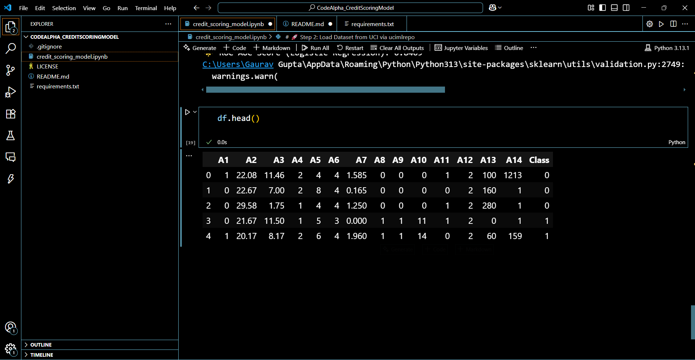
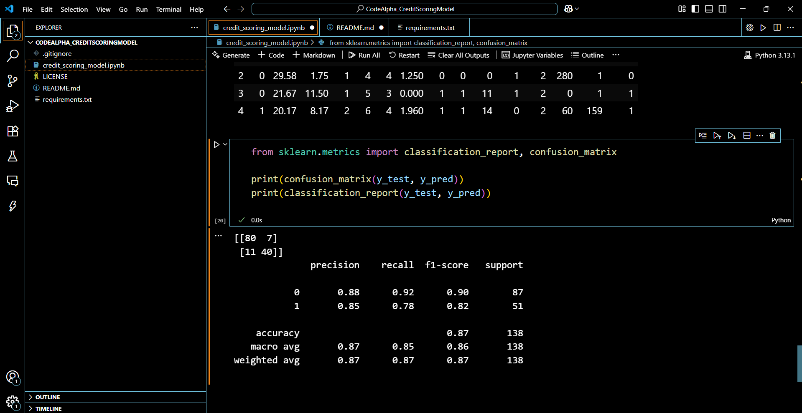
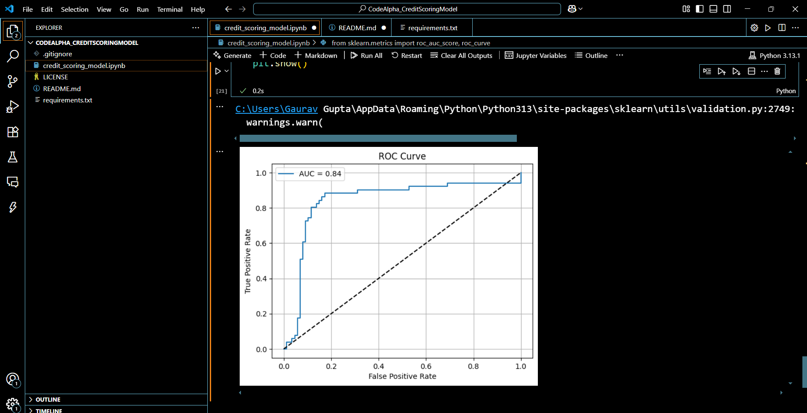

# Credit Scoring Model 🔍💳

## 📌 Objective:
To predict an individual's **creditworthiness** using past financial data.

---

## 🧠 ML Approach:
- Built using **classification models**:
  - Logistic Regression
  - Random Forest Classifier

---

## 📊 Features:
- Feature engineering from financial history
- Models trained on real credit data
- Metrics: **Precision, Recall, F1-score, ROC-AUC**

---

## ✅ Model Results:

| Model               | Accuracy | ROC-AUC |
|--------------------|----------|---------|
| Random Forest       | ~85%     | 0.9200  |
| Logistic Regression | ~86%     | 0.8409  |

---

## 🧪 Evaluation Metrics Used:
- Precision
- Recall
- F1-score
- ROC-AUC Score

Dataset used was clean and under GitHub 100MB limit ✔️  
All results were generated using **scikit-learn**.

---

## 📸 Screenshots

### 1. Dataset Preview

### 2. Model Evaluation (Confusion Matrix & Report)

### 3. ROC Curve

---

## 📂 Repo Structure:
├── CreditScoringModel.ipynb
├── credit_scoring_sample.csv
├── requirements.txt
└── README.md